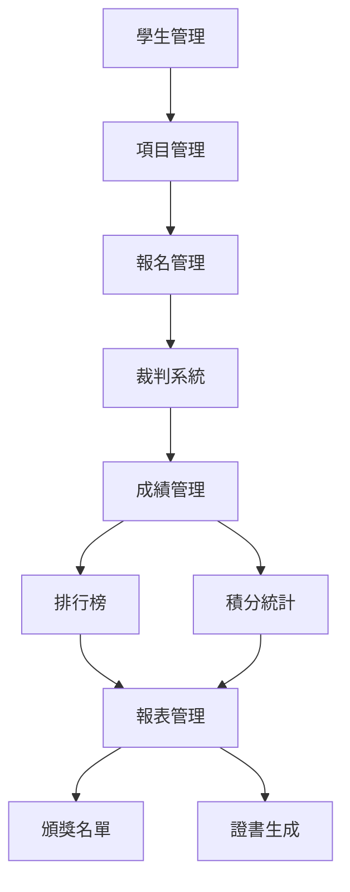

# 運動會管理系統架構規劃

## 📋 系統架構概覽

```
運動會管理系統
├── 基礎管理模組
│   ├── 學生管理 ✅
│   ├── 項目管理 ✅
│   └── 報名管理 ✅
├── 比賽執行模組
│   ├── 裁判系統 🔄
│   ├── 成績管理 🔄
│   └── 即時顯示 🔄
├── 統計分析模組
│   ├── 排行榜 🔄
│   ├── 積分統計 🔄
│   └── 紀錄管理 🔄
└── 報表輸出模組
    ├── 報表管理 🔄
    ├── 證書生成 🔄
    └── 頒獎名單 🔄
```

## 🏃‍♂️ 資料流程設計

### 1. 核心資料流

```
學生報名 → 初賽記錄 → 決賽篩選 → 成績統計 → 排行榜 → 頒獎名單
    ↓         ↓         ↓         ↓         ↓         ↓
 報名表     裁判表    決賽表    積分表    排名表    證書/獎狀
```

### 2. 模組間依賴關係



## 🎯 各模組詳細功能分工

### 📊 裁判系統 (Judge System)

**主要功能**：
- 🏃‍♂️ **比賽初賽記錄表**
  - 按項目自動生成裁判記錄表
  - 支援徑賽（時間記錄）、田賽（距離/高度記錄）、接力賽
  - 實時錄入選手成績和名次
  - 自動計算項目內排名

**子功能模組**：
```
裁判系統/
├── 初賽記錄管理
│   ├── 徑賽計時表 (Track Events)
│   ├── 田賽測量表 (Field Events)
│   └── 接力賽記錄表 (Relay Events)
├── 成績驗證
│   ├── 數據合理性檢查
│   ├── 紀錄突破提醒
│   └── 錯誤修正功能
└── 決賽篩選
    ├── 自動篩選決賽名單
    ├── 同成績處理規則
    └── 決賽表生成
```

**資料結構**：
- `JudgeSheet`: 裁判記錄表
- `EventResult`: 項目成績
- `PerformanceRecord`: 表現記錄
- `QualificationResult`: 晉級結果

---

### 🏆 成績管理 (Results Management)

**主要功能**：
- 📋 **成績統計與計算**
  - 個人項目積分計算（9-7-6-5-4-3-2-1分制）
  - 接力項目積分計算（雙倍分數）
  - 破紀錄加分處理（+3分）
  - 平分處理邏輯

**子功能模組**：
```
成績管理/
├── 積分計算引擎
│   ├── 個人項目積分 (Individual Scoring)
│   ├── 接力項目積分 (Relay Scoring)
│   ├── 破紀錄獎勵分 (Record Bonus)
│   └── 平分平均處理 (Tie Breaking)
├── 成績驗證系統
│   ├── 資料完整性檢查
│   ├── 積分計算驗證
│   └── 異常成績標記
└── 成績匯總
    ├── 個人總積分統計
    ├── 班級總積分統計
    └── 組別積分排名
```

**計分規則實現**：
```dart
// 個人項目積分
Map<int, int> individualPoints = {1: 9, 2: 7, 3: 6, 4: 5, 5: 4, 6: 3, 7: 2, 8: 1};

// 接力項目積分（雙倍）
Map<int, int> relayPoints = {1: 18, 2: 14, 3: 12, 4: 10, 5: 8, 6: 6, 7: 4, 8: 2};

// 破紀錄加分
const int recordBonus = 3;
```

---

### 🏅 排行榜 (Rankings)

**主要功能**：
- 📈 **即時排名顯示**
  - 個人積分排行榜
  - 班級積分排行榜
  - 分組別排行榜（男甲乙丙、女甲乙丙）
  - 項目冠軍統計

**子功能模組**：
```
排行榜/
├── 即時排名系統
│   ├── 個人排名 (Individual Rankings)
│   ├── 班級排名 (Class Rankings)
│   ├── 組別排名 (Division Rankings)
│   └── 項目排名 (Event Rankings)
├── 排名算法
│   ├── 積分排序邏輯
│   ├── 同分處理規則
│   └── 排名變化追蹤
└── 顯示介面
    ├── 大屏幕顯示模式
    ├── 手機友好顯示
    └── 可列印排名表
```

**排名邏輯**：
- **個人排名**：總積分 → 項目數量 → 最高單項分數
- **班級排名**：班級總分 → 參與人數 → 冠軍數量
- **組別排名**：組別內班級競爭

---

### 📋 報表管理 (Reports Management)

**主要功能**：
- 📊 **綜合報表生成**
  - 成績總表匯出
  - 頒獎名單生成
  - 證書批量製作
  - 統計分析報告

**子功能模組**：
```
報表管理/
├── 頒獎名單生成
│   ├── 個人獎項名單
│   │   ├── 各組別冠亞季軍
│   │   ├── 個人全能獎
│   │   └── 破紀錄獎
│   ├── 班級獎項名單
│   │   ├── 各組別班級冠亞季軍
│   │   ├── 最佳體育精神獎
│   │   └── 最佳參與獎
│   └── 特殊獎項名單
├── 證書/獎狀生成
│   ├── 個人證書模板
│   ├── 班級錦旗模板
│   ├── 批量生成功能
│   └── PDF匯出功能
├── 統計報告
│   ├── 整體參與統計
│   ├── 破紀錄統計
│   ├── 項目受歡迎度分析
│   └── 班級參與度分析
└── 資料匯出
    ├── Excel格式匯出
    ├── PDF報表匯出
    ├── CSV資料匯出
    └── 列印友好格式
```

## 📱 頁面導航結構

```
主頁
├── 基礎管理
│   ├── 學生管理 ✅
│   ├── 項目管理 ✅
│   └── 報名管理 ✅
├── 比賽進行
│   ├── 裁判系統 🔄
│   │   ├── 初賽記錄
│   │   ├── 決賽篩選
│   │   └── 成績確認
│   └── 即時成績 🔄
├── 統計排名
│   ├── 排行榜 🔄
│   │   ├── 個人排名
│   │   ├── 班級排名
│   │   └── 組別統計
│   └── 積分統計 🔄
└── 報表匯出
    ├── 報表管理 🔄
    │   ├── 成績總表
    │   ├── 頒獎名單
    │   └── 統計報告
    └── 證書生成 🔄
```

## 🔄 開發優先順序

### 第一階段：比賽執行 (Week 1-2)
1. **裁判系統** - 初賽記錄表功能
2. **成績管理** - 基本積分計算
3. **排行榜** - 即時排名顯示

### 第二階段：統計分析 (Week 3)
1. **積分統計** - 深度分析功能
2. **紀錄管理** - 歷史比較
3. **決賽篩選** - 自動化處理

### 第三階段：報表輸出 (Week 4)
1. **報表管理** - 完整報表系統
2. **證書生成** - 自動化證書製作
3. **頒獎名單** - 各類獎項統計

## 🎯 核心價值定位

### 用戶價值
- **學校行政人員**：完整的賽事管理解決方案
- **體育老師**：簡化的裁判記錄和成績統計
- **班主任**：即時的班級表現追蹤
- **學生家長**：透明的成績查詢和排名

### 技術價值
- **模組化設計**：各功能獨立開發和維護
- **資料一致性**：統一的資料模型和流程
- **擴展性**：支援不同規模和類型的運動會
- **用戶體驗**：響應式設計，支援多設備使用

## 🛠️ 技術實現重點

### 資料同步策略
- **本地優先**：支援離線記錄，網路同步
- **即時更新**：WebSocket實現即時排行榜
- **資料備份**：自動備份和恢復機制

### 效能優化
- **懶載入**：大量資料分頁載入
- **快取策略**：智能快取排行榜和統計資料
- **並行處理**：積分計算使用多線程

### 安全性考慮
- **資料驗證**：嚴格的輸入驗證和資料格式檢查
- **操作日誌**：完整的操作記錄和審計跟蹤
- **權限控制**：不同角色的功能權限管理

---

## ✅ 總結

此架構設計確保了：
1. **功能完整性**：覆蓋運動會管理的完整流程
2. **模組獨立性**：各模組可獨立開發和測試
3. **資料一致性**：統一的資料流和處理邏輯
4. **用戶友好性**：直觀的界面和流暢的操作體驗
5. **可擴展性**：支援未來功能擴展和定制需求

這個架構為香港中學運動會管理提供了完整、專業、可靠的解決方案。 